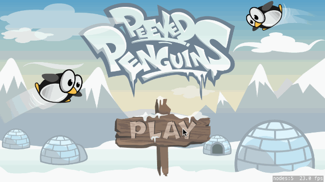

# Peeved Penguins Tutorial :penguin:

## What you will learn :white_check_mark:
- Switch scenes from a main menu to gameplay
- Create a camera to follow game actions
- Utilize the SpriteKit physics engine
- Use Physics Joints to model a catapult's launch
- Load different levels from SKS files
- Use timeline to create character animations
- Make an iPhone and iPad compatible game
- Texture atlas and performance optimization

Upon completing this tutorial, you will have learned how to:

## Common issues :bug:

## What you should understand when finished :checkered_flag:
